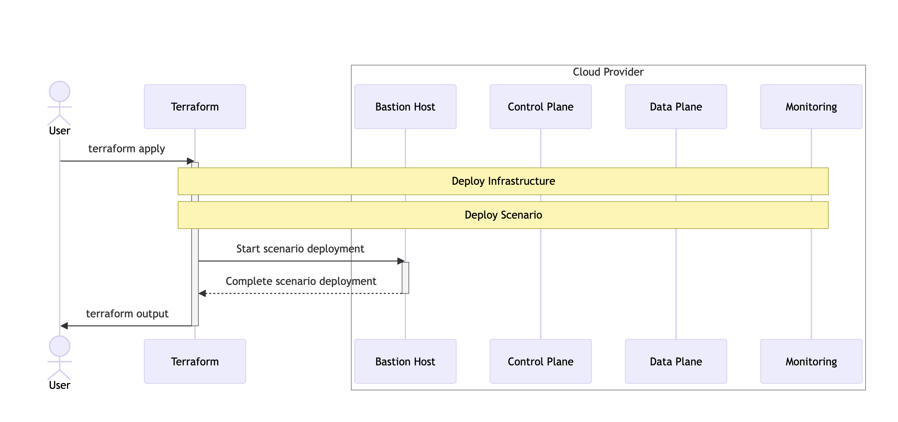

[Home](../README.md)

# Bastion Host

The scenario deployment is based on the existence of a VM with SSH server 
installed and which has networking access via SSH to all other VMs.

The Bastion Host is equipped with all the tools necessary for the scenario 
deployment so it is not needed to have the tools on your local machine.

## Bastion Host Specs

### Tools

The following tools are installed on the bastion host:

Base Packages: `apt-transport-https` `ca-certificates` `curl` `gnupg-agent` `software-properties-common` `jq` `dnsutils` `tree`. 

### HashiCorp tools

The Bastion Host also has the `consul` and the `envoy` binaries installed.

### Users

The *Bastion Host*, as well as all the other VMs that compose the scenario come with an `admin` user account that has all necessary permissions and certificates needed to operate the scenario.

All the files needed for the scenario are copied inside the `/home/admin/` folder.

### DNS

For simplicity, the Bastion Host is configured to resolve all the other nodes hostname.

This means that Bastion Host node is the last one to be deployed in the *Infrastructure* step, to inject DNS information inside the node.

## Bastion Host workflow

Every scenario is constituted by a two step logical deployment:

* An *Infrastructure* step, in which the scenario infrastructure is deployed
* A *Deployment* step, in which the Bastion Host is used to run the commands that configure the scenario components.

