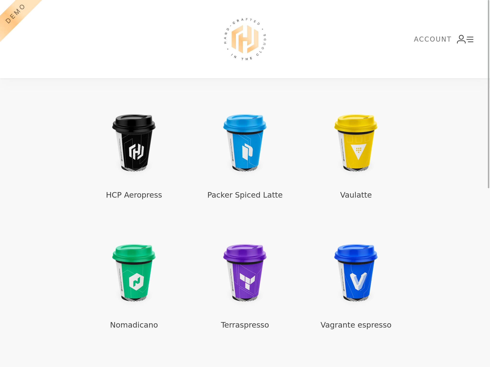
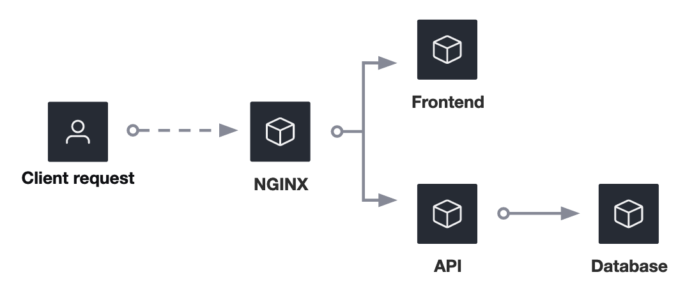
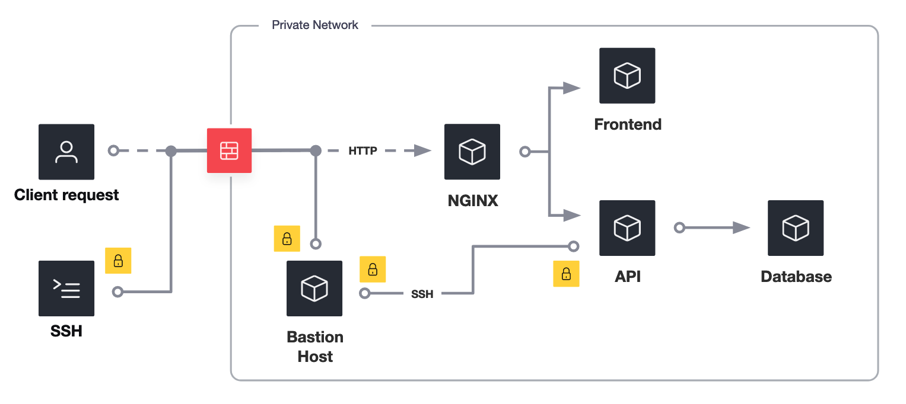

[Home](../README.md) > [Docs](./README.md) > HashiCups

# HashiCups on VMs

HashiCups is a multi-tier demo coffee shop application made up of several services.



Based on its architecture it can run from different solutions, from VMs to Kubernetes.

## VM based Architecture

The application is composed by a mix of microservices and monolith services running on four different VMs.

1. `NGINX`: an NGINX server configured as reverse proxy for the application. This layer can also be configured to act as a load balancer across different instances of the underlying services, `API` and `Frontend`. This is the only service that should be publicly accessible. 
1. `FRONTEND`: the application frontend.
1. `API`: the application API layer. Is composed by multiple services but all of them are running on the same host, waiting to be migrated into microservices.
1. `DATABASE`: a PostgreSQL instance.


### Service Map

The service communication flows are shown in the following diagram.



The table shows more details on the services structure.

| Service       | PORT      | Upstream
| ------------- | --------- | ---------------
| database      | `5432`    | []
| api           | `8081`    | [database]
|   - payments  |   `8080`  |   []
|   - product   |   `9090`  |  *[database]
|   - public    |  *`8081`  |   [api.product, api.payments]
| frontend      | `3000`    | [api.public]
| nginx         | `80`      | [frontend, api.public]

* `Service`: name of the service. In the environments names are composed using the following naming scheme:
    ```
    hashicups-<service-name>[-<sub-service-name>]
    ```
* `Port`: the port on which the service is running. The *api* meta-service is using multiple ports, one per sub-service. The one marked with a `*` is the only one that requires external access.
* `Upstream`: represent the dependencies each service has. If one of the services mentioned in this column is not working properly, then the service will not work either.

## The base deployment - Perimeter based security

Introduce Consul in your environment requires multiple steps, one of them is the introduction of Consul in a scenario with an application already deployed.

This is the case of the [Consul Getting Started](https://developer.hashicorp.com/consul/tutorials/get-started-vms) tutorial collection. 

There you can learn how to increase the network security for an existing HashiCups deployment.

The initial deployment used as an example is a basic network configuration that uses a perimeter-based approach to secure services and resources.



In this architecture, your resources are separated from the internet via a ***private network***.

Services run on ***VMs***. 

Every VM can connect with all other VMs and services are ***not secured with TLS***. This is not a very secure approach, every service should be behind TLS. To achieve that, the service either needs to be TLS-aware or needs to be behind a reverse-proxy that does TLS termination.

Every VM runs an ***SSH service*** to allow connections from other VMs.

In a typical configuration, VMs are not accessible outside the private network with the exception of a ***Bastion Host*** that is used to perform operational tasks such as installation and maintenance. 


